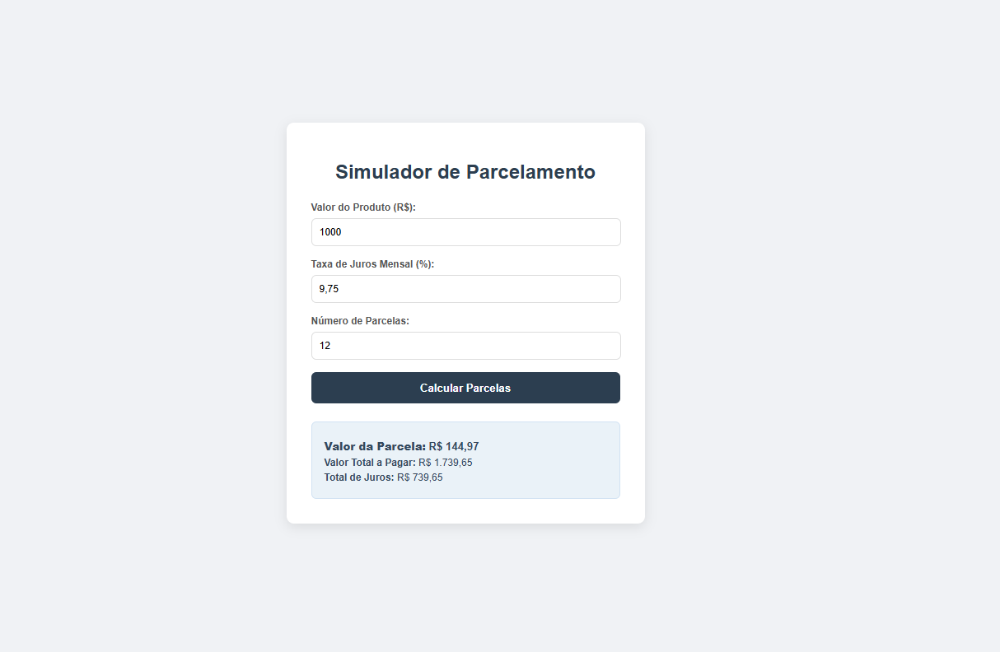

# Simulador de Parcelamento com Juros

Este projeto é um simulador financeiro construído com Vanilla JavaScript para ajudar os usuários a calcular o valor de parcelas e o total de juros em uma compra. A aplicação resolve o problema da tomada de decisão em compras parceladas, fornecendo de forma clara o custo real da operação.

## Tecnologias

- **Vanilla JavaScript**: Toda a lógica de cálculo, validação e manipulação do DOM é feita com JavaScript puro.
- **HTML5**: Estrutura semântica para o formulário e a área de resultados.
- **CSS3**: Estilização limpa e moderna para uma interface de usuário agradável.

## Funcionalidades

- **Cálculo de Parcelas**: Calcula o valor exato de cada parcela com base no valor do produto, taxa de juros e número de parcelas.
- **Total de Juros**: Exibe o valor total de juros pagos ao final do parcelamento.
- **Validação de Dados**: Garante que os campos do formulário sejam preenchidos com valores numéricos válidos.
- **Interface Intuitiva**: Um design simples e focado, que torna a simulação rápida e fácil.

## Fórmula Matemática

O cálculo do valor da parcela é baseado na fórmula de amortização **Price**, que é a mais utilizada em financiamentos de juros compostos.

A fórmula é a seguinte:

$$
\text{Parcela} = \text{Valor do Produto} \times \frac{i \times (1 + i)^n}{(1 + i)^n - 1}
$$

Onde:

- $i$ = Taxa de juros mensal (convertida de porcentagem para decimal)
- $n$ = Número de parcelas

## Como Executar o Projeto

Para rodar a aplicação localmente, basta abrir o arquivo `index.html` em qualquer navegador moderno. Não é necessário instalar nenhuma dependência ou usar um servidor local.

## Estrutura do Projeto

- **`index.html`**: Contém a estrutura do formulário de entrada e a área para exibir os resultados.
- **`style.css`**: Define a aparência de todos os elementos da página.
- **`script.js`**: Contém a lógica de cálculo e a manipulação dos elementos do DOM para exibir o resultado.

---

# Detalhe do projeto

